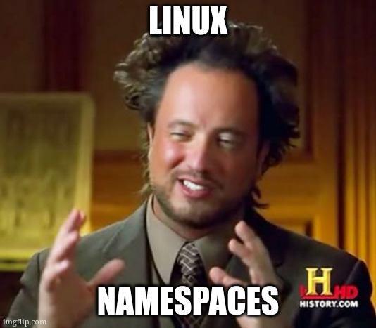
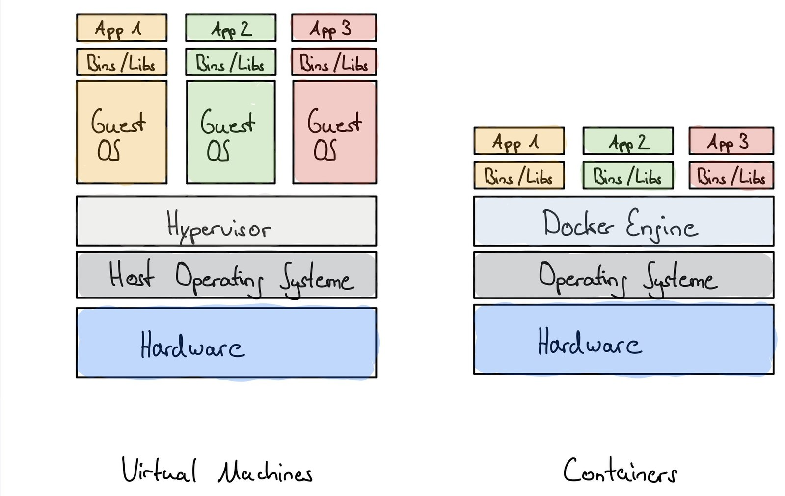

<style>
  :root {
    font-size: 35px
  }
</style>

# Introductory Workshop to Containers!
by Drakulix


---

## What even is a container?

- A linux kernel feature
- Actually several features
- Lets get technical...

<!--
The Linux kernel obviously stores a lot of state,
what processes exist, what file systems are mounted, etc.

So what if it broke parts of that state into different
spaces. So if a process belonging to space A wants to 
access the state it only gets parts of space A. And if
a process belonging to B does an operation on *the* state? 
It would only reflect on state B and thus processes in that 
group.

That, just more fine-grained, is essentially what namespaces are.
-->

---



---

## Example: Network namespace

```sh
drakulix@fedora ~> ip link
1: lo: <LOOPBACK,UP,LOWER_UP> mtu 65536 qdisc noqueue state UNKNOWN mode DEFAULT group default qlen 1000
    link/loopback 00:00:00:00:00:00 brd 00:00:00:00:00:00
2: enp0s1: <BROADCAST,MULTICAST,UP,LOWER_UP> mtu 1500 qdisc fq_codel state UP mode DEFAULT group default qlen 1000
    link/ether 7a:c2:03:0d:3d:07 brd ff:ff:ff:ff:ff:ff
```

```sh
drakulix@fedora ~> sudo unshare -n ip link
1: lo: <LOOPBACK> mtu 65536 qdisc noop state DOWN mode DEFAULT group default qlen 1000
    link/loopback 00:00:00:00:00:00 brd 00:00:00:00:00:00
```

---

## Example: PID-namespace

```sh
drakulix@fedora ~> sudo unshare -p --fork --mount-proc ps -a
    PID TTY          TIME CMD
      1 pts/6    00:00:00 ps
```

---

## Types of Namespaces

- mount namespaces
- uts namespaces
- ipc namespaces
- network namespaces
- PID namespaces
- cgroup namespaces
- user namespaces
- time namespaces

<!--
UTS = hostname (???)
-->

---

## Container <--> Virtual Machine



<!--
- Smaller security boundary
- Less overhead even compared to para-virtualization
- No separate kernel (pro and con)
- Less specialized hardware
-->

---

## Docker


- Abstracts over all of this namespace stuff
- Adds images to the mix
- Example:

```sh
docker run \
    -p 80:80/tcp \
    -v ./my-website:/usr/share/html/nginx \
    nginx:latest
```

---

## The Workshop

**https://github.com/drakulix/37c3-container-workshop**

