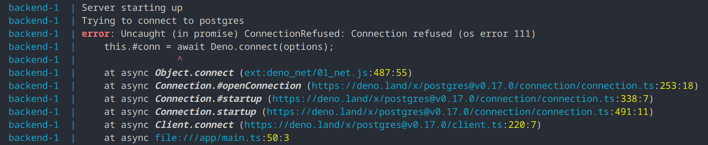

## Chapter 4 - Docker compose

This is getting a bit unwieldy.

We have now 2 containers running (postgres and nginx - as seen in `docker ps`), multiple images downloaded and one built ourselves (see in `docker images`) and we are getting to the point where they need to talk to each other (nginx -> backend and backend -> postgres).

So lets introduce our last new tool to fix this: docker-compose.

### Installing docker-compose

- If you installed `Docker Desktop` you already have the compose plugin
- If you only installed `Docker Engine`, you can install the plugin from the same repository you installed docker from: https://docs.docker.com/compose/install/linux/#install-using-the-repository
  - On Windows follows the Debian instructions inside a WSL2 shell
  - On MacOS you can install docker-compose via `brew`
- If you installed `podman` / `Podman Desktop` you can:
  - Either install [`podman-compose`](https://github.com/containers/podman-compose). Note that podman-compose is not 100% identical to docker-compose, but close enough for everything you will need in this tutorial. I would still recommend to go with the second option:
  - Just install [`docker-compose`]. Since podman is api-compatible to docker and docker-compose is a separate tool it will just work!
    - You should preferably install the tool through the package manager of your distribution.
    - Alternatively the standalone version (https://docs.docker.com/compose/install/standalone/) will work just fine with podman as well.
    - On MacOS/Windows you will need to enable `Docker compatibility` in `Podman Desktop`.
  - You can then use `podman compose` in place of `docker compose`, which will in turn use either tool and set up everything transparently.

### Running docker-compose

Docker compose can start up a bunch of services (and networks and volumes) for you using:
- `docker compose up` (or detached `docker compose up -d`).

You can then later stop these services:
- `docker compose down`

Or even remove all persistent data:
- `docker compose rm`

(See how these are similar to `docker run`/`docker start` and `docker stop`/`docker rm`?)

To do that it relies on a `docker-compose.yml` configuration file that describes the services to be run.

*"Another configuration file format?!"*, I hear you screaming. But don't worry, this is essentially the same as the `docker run`-commands you have been using the whole time.

See:
- [Key features of Docker compose](https://docs.docker.com/compose/features-uses/) as an introduction.
- [Compose file references](https://docs.docker.com/compose/compose-file/)
  - Most importantly the [`services`-entry reference](https://docs.docker.com/compose/compose-file/05-services/)

### Requirements

- [ ] Create a compose file in the root of this repository
- [ ] Add a `db`-service that replicates our postgres service. ([Hint](https://docs.docker.com/compose/compose-file/05-services/#image) and [Hint](https://docs.docker.com/compose/compose-file/05-services/#environment))
- [ ] Add an `nginx`-service that replicates our nginx service ([Hint](https://docs.docker.com/compose/compose-file/05-services/#ports) and [Hint](https://docs.docker.com/compose/compose-file/05-services/#volumes)) 
- [ ] Add a new `backend`-service
  - [ ] You don't have a name for this image on the docker-hub, because it's a local one. But even better docker-compose can build it for you, if missing. Use a `build` key instead and point it to your `Dockerfile`. ([Hint](https://docs.docker.com/compose/compose-file/build/#attributes))
  - [ ] The service needs some environment variables to connect to the database:
     - [ ] `PGHOST=[name of your database container]`
     - [ ] `PGUSER=postgres` (default of the postgres image)
     - [ ] `PGPASSWORD=[the same password you set on the database container]`
     - [ ] `PGDATABASE=postgres` (default of the postgres image)
  - [ ] It also depends on the database container already running to make it's connection, so add a `depends_on` entry ([Hint](https://docs.docker.com/compose/compose-file/05-services/#depends_on))

**Note**: If you worked around SELinux in Chapter 2, you will need to add the same flag for every service in your docker-compose.yml, that uses bind-mounts as well:
```
security_opt:
- "label=disable"
```

Try your file using `docker compose up`!

You might wonder how your containers can even talk to another. Fortunately docker-compose sets up a network for us and automatically connects all our containers together, so they can find each other by their names. Neat!

### Reading your logs and debugging the app

If you got this far, you probably got a bunch of colorful logs for your three containers.
While the database and nginx are probably starting up rather uneventfully without many issues, the backend probably still errors out with "Connection refused (os error 111)".



How could this be, we clearly defined the dependencies! This is one of the more common pitfalls of docker-compose. It is not a service manager, it doesn't look inside the containers, it just makes sure the container is running, but the database process itself takes a few moments to be available.

Historically there have been many "solutions" to this problem.
- The most brittle one (and still quite popular) is to just add a little `sleep` to the start of our backend and prey our database doesn't need a little longer.
- A little more advanced, but still as ugly is instructing docker-compose to restart our failing container with `restart: on-failure`. Which will at least likely work eventually while burning cpu resources in the meantime.
- What our restarting does it effectively just check for a database connection, people have built scripts to test for a connection in a loop, a very popular one is `wait-for-it`: https://github.com/vishnubob/wait-for-it

But we can do a little better.

Docker differentiates between `running` and `healthy` containers. A `healthy` database container is one accepting connections. But for a container to enter the `healthy` state, it needs to have a `healthcheck`.
So [read up](https://docs.docker.com/compose/compose-file/05-services/#healthcheck) on it in the compose-file reference. The postgres container fortunately comes with a neat little program to check for database availability called `pg_isready`, which is what we want to execute in our healthcheck.

Now we can fix our `depends_on` entry by [adding a condition](https://docs.docker.com/compose/compose-file/05-services/#long-syntax-1).

(**Note**: The healthcheck is nothing specific to docker-compose, you can specify those with `docker run` just as well, inspect the health-status with `docker ps` or even specify a default `HEALTHCHECK` in your `Dockerfile` to help your users. The only thing docker-compose adds here is the `depends_on` entry to orchestrating start up of the containers.)

### Outro

So now you should have a fully working chat app on `http://localhost:8000`.

If not, check the `solution`-branch of this repository for my `docker-compose.yml` and `Dockerfile`.

If you found any part to be particularly unintuitive or the hints misleading, please consider opening an issue describing your experience. I am sure there is room for improvement here. Nevertheless, I hope you had fun and learned something along the way.

If you feel like you want to cleanup your solution a bit more and see what there is more in the world of containers, go [here](./5-more.md) for a few follow up problems.

`:)`
